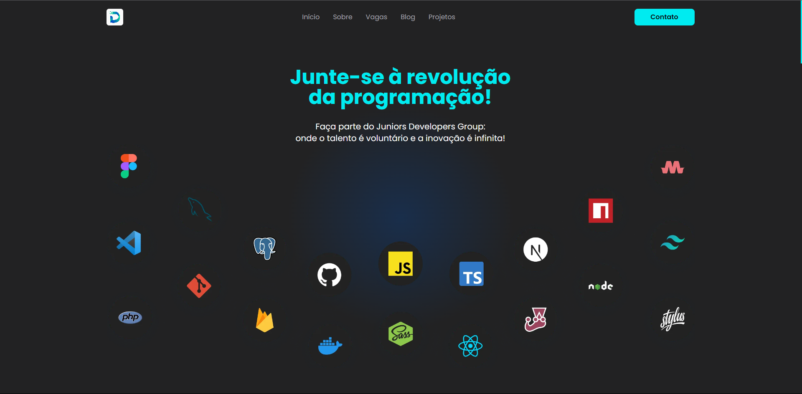
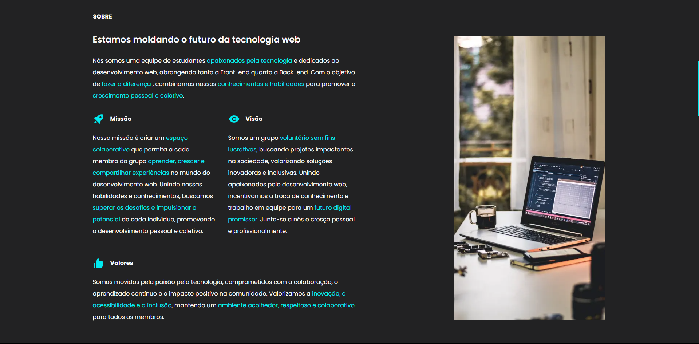
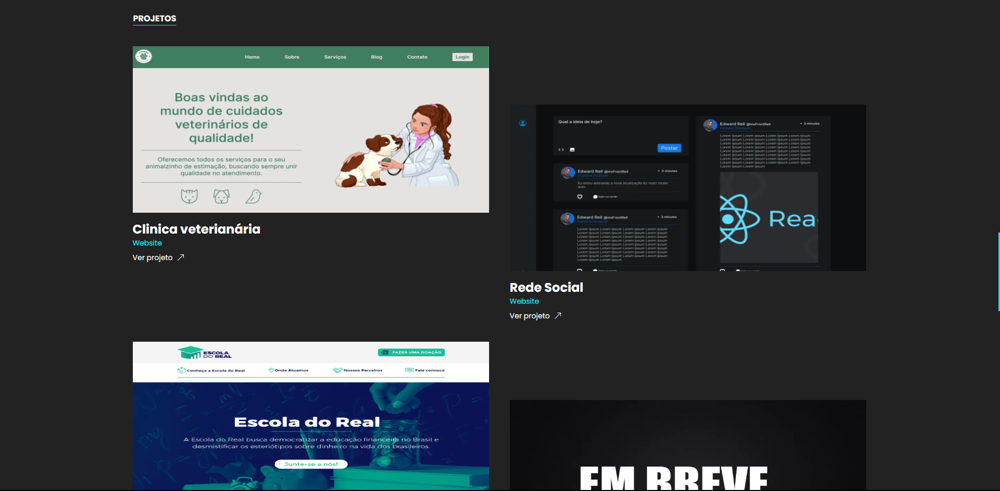
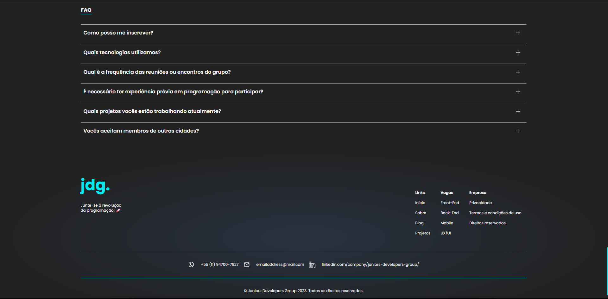
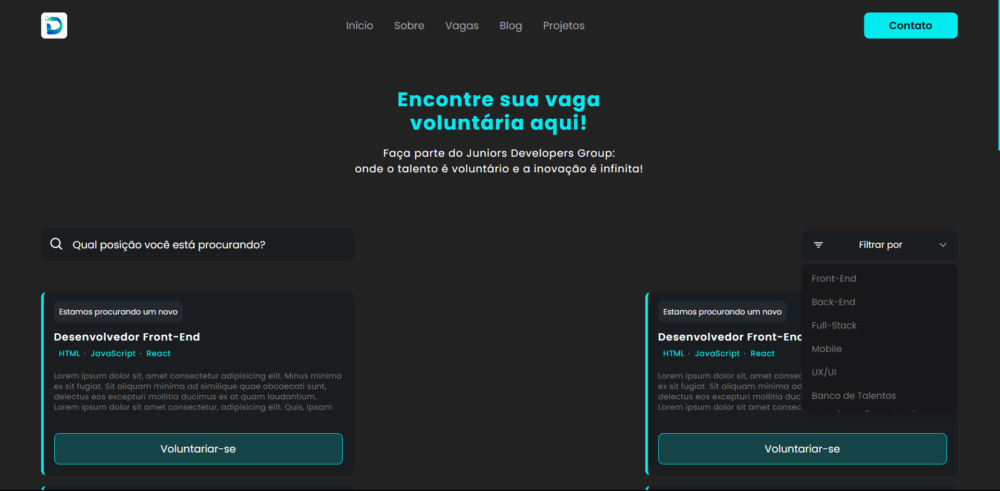
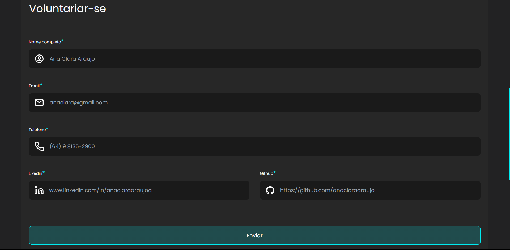
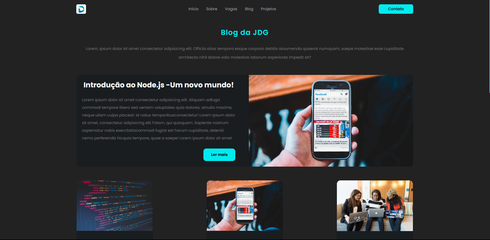

   
<h1>JDG - Website</h1> 

### JDG - Website - [Ver Projeto](https://voluntary-jdg-website.vercel.app/)

Tive a oportunidade de participar de um dos projetos do grupo ``JDG``, no qual foi o próprio webiste deles.

Nesse projeto fui responsável pela criação dos seguintes: ``Header, Tela inicial, Projetos, FAQ, Vagas, Formulário de inscrição da vaga (rotas dinâmicas), Blog, Informações da postagem (rotas dinâmicas) com toda responsividade.``

Essa é uma versão com dados mocados para melhor desempenho.

## Layout web
 

 

## 🛠️ Tecnologias

💻 **Front-end**
- [Next.js 13.4](https://nextjs.org)
- [Typescript](https://www.typescriptlang.org)

📚 **Bibliotecas**
- [react-hook-form](https://react-hook-form.com/)
- [react-toastify](https://www.npmjs.com/package/react-toastify)
- [react-icons](https://react-icons.github.io/react-icons/)
- [swiperjs](https://swiperjs.com/demos)

🎨 **Estilização**
- [tailwindcss](https://tailwindcss.com/docs/installation)

🔋 **Versionamento e Deploy**
- [Git](https://git-scm.com)
- [Vercel](https://vercel.com/)

 

⚙️ **Configuranções e Instalações**

Clone do Projeto

    $ git clone https://github.com/renovatt/voluntary-jdg-website.git

Instalando as dependências

    $ npm install

Iniciando o projeto

    $ npm run dev

Configuranções do VSCode

     {
      "[prisma]": {
        "editor.formatOnSave": true
      },
      "editor.codeActionsOnSave": {
        "source.fixAll.eslint": true,
        "source.addMissingImports": true
      }
    }

 

🤝 **Contribuidores**

<table style="border-collapse: separate; border-spacing: 10px;">
  <tbody>
    <tr>
      <td align="center" valign="top" width="14.28%" style="border-radius: 10px; padding: 10px; background-color: #fafafa;">
          <a href="https://github.com/anaclaraaraujo">
             
            <b>Ana Clara Araujo</b>
          </a>
           
          <a href="#Design" title="Design">🎨</a>
        </td>
      <td align="center" valign="top" width="14.28%" style="border-radius: 10px; padding: 10px; background-color: #fafafa;">
          <a href="https://github.com/renovatt">
             
            <b>Willdemberg</b>
          </a>
           
          <a href="#Code" title="Code">💻</a>
        </td>
      <td align="center" valign="top" width="14.28%" style="border-radius: 10px; padding: 10px; background-color: #fafafa;">
          <a href="https://github.com/matheusOliv23">
             
            <b>Matheus Henrique</b>
          </a>
           
          <a href="#Code" title="Code">💻</a>
        </td>
    </tr>
  </tbody>
</table>